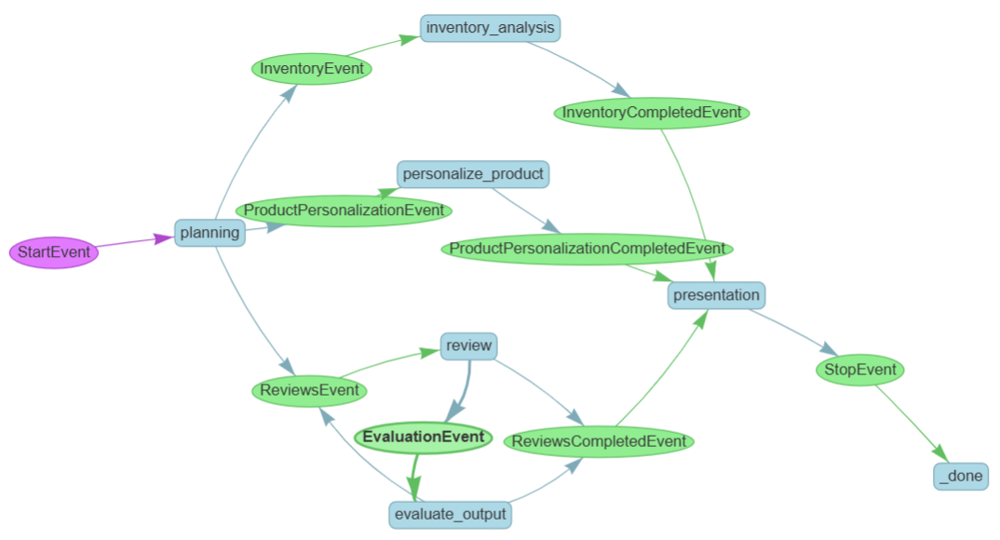

# AgenticShop：AIエージェント時代の刷新されたショッピング体験
このリポジトリは、マルチエージェントワークフローの機能を活用して、エージェントフローの力をLlamaindexで示しています。このソリューションは、電子ガジェットの購入に興味がある個々の強化されたショッピングを体験するために開発されました。これは、`azure cli` を使用した、テストとデプロイが簡単なワンクリックソリューションです。完全なレイアウトについては、アーキテクチャ図を参照してください：

- [主要な機能](#key-features)
- [アーキテクチャ図](#architecture-Diagram)
- [ソリューションアクセラレータのデプロイメント](#solution-accelerator-deployment)
- [削除](#tear-down)

## Key Features
小売ソリューションアクセラレータは、以下の機能を提供します：
- ユーザープロファイルに基づいたパーソナライズされた製品詳細
- ユーザーエクスペリエンスの向上
- マルチエージェントワークフローにより、複数のタスクをシームレスに処理
- エージェントトリガーとトラッキングのためのArize Phoenixトレーシングを使用したデバッグパネル

## Architecture Diagram


## Solution Accelerator Deployment

### CloudShell
このソリューションは、CloudShell経由でデプロイ可能に設計されています。ローカルの開発マシンからデプロイすることを希望する場合は、以下の手順に従ってください。

### 前提条件
このソリューションのデプロイメントには、以下が前提条件となります：
1. [Azure Developer Cli](https://learn.microsoft.com/en-us/azure/developer/azure-developer-cli/install-azd?tabs=winget-windows%2Cbrew-mac%2Cscript-linux&pivots=os-linux)
2. [Azure Cli](https://learn.microsoft.com/en-us/cli/azure/install-azure-cli)
3. [Azure Cli extension](https://learn.microsoft.com/en-us/cli/azure/azure-cli-extensions-overview) `rdbms-connect`
4. アクティブなサブスクリプションを持つAzureアカウント。
5. [Python 3.8+](https://www.python.org/downloads/)
6. [Powershell Core](https://learn.microsoft.com/en-us/powershell/scripting/install/installing-powershell-on-windows?view=powershell-7.5) (Windowsユーザーのみ)

### デプロイメント手順
注：このインフラストラクチャのバージョンは、動作するソリューションを正常にデプロイします。ただし、Azure Key Vault、Azure App Configなどの一部のモジュールやベストプラクティスはまだ進行中です。
これらのモジュールとベストプラクティスは近日中に最終化され、実装される予定です。

### リポジトリのクローン
リポジトリをクローンします。完了したら、リポジトリに移動します
```sh
git clone https://github.com/Azure-Samples/postgres-agentic-shop.git
cd postgres-agentic-shop
```

### Azureアカウントへのログイン
`azure cli`にログインするには、次のコマンドを使用します：
```sh
az login
```

`azure developer cli`にログインするには、このコマンドを使用します：
```sh
azd auth login
```

上記のコマンドが失敗した場合は、次のフラグを使用します：
```sh
azd auth login --use-device-code
```

### 新しいazure開発者環境の作成
新しい`azd`環境を初期化し、作成します。`azd`環境に名前を付けてください
```sh
azd init
```

### azdフックスクリプトへの権限付与
Windows OSでソリューションをデプロイする場合は、現在のセッションに`pwsh`スクリプトを実行するための次の権限を付与します
```sh
Set-ExecutionPolicy -Scope Process -ExecutionPolicy Bypass
```

Windows OS上のunix-like環境（例：cygwin、minGW）をデプロイする場合は、現在のセッションに`pwsh`スクリプトを実行するための次の権限を付与します
```sh
pwsh -NoProfile -Command "Set-ExecutionPolicy -Scope CurrentUser -ExecutionPolicy Bypass"
```

### ソリューションのデプロイメント
リソースをプロビジョニングするために、次のコマンドを実行します。
```sh
azd up
```

このコマンドを実行すると、プロンプトがデプロイメントのサブスクリプション、ソリューションアクセラレータリソースの場所とAzure OpenAIモデルの場所、および作成するリソースグループを尋ねます。デプロイメントの地域で十分なAzure OpenAIモデルのクォータがあることを確認してください。このソリューションに必要なAzure OpenAIのクォータは以下に記載されています。この設定は、`infra`ディレクトリの`main.parameters.json`ファイルを使用して以下のパラメータで変更できます。デプロイメントには時間がかかる場合があり、進行状況はターミナルとAzure Portalの両方で提供されます。
- **GPT-4o:** 140K TPM - `AZURE_OPENAI_CHAT_DEPLOYMENT_CAPACITY`
- **text-embedding-ada-002:** 60K TPM - `AZURE_OPENAI_EMBED_DEPLOYMENT_CAPACITY`

### トラブルシューティング
1. `azd cli`のトラブルシューティングガイドは[こちら](https://learn.microsoft.com/en-us/azure/developer/azure-developer-cli/troubleshoot?tabs=Browser)です。
2. 初期化または新しいenvの作成時にサポートされていない文字が使用されると、検証エラーが発生します。
3. ユーザーが`azd cli`を実行する際に適切な権限を持っていないと、スコープエラーが発生します。ユーザーの権限をサブスクリプションレベルに更新してください。
4. `リソースエンティティのプロビジョニング状態が端末ではない`エラーが発生した場合、`azd up`コマンドを使用してデプロイメントを再起動します。

## Tear Down
上記のステップで作成されたすべてのリソースを破棄し、ソリューションアクセラレータによってデプロイされたアカウントを削除するには、以下のコマンドを使用します：
```sh
azd down --purge
```
purgeフラグはすべてのアカウントを永久に削除します。

### パーソナライゼーションワークフロー
以下は、その可視化ツールを介して生成されたLlamaIndexワークフローです：

